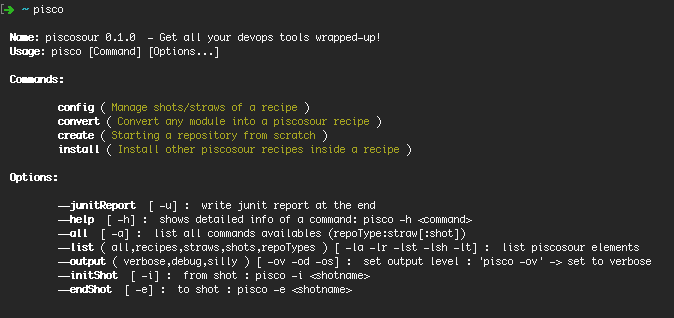
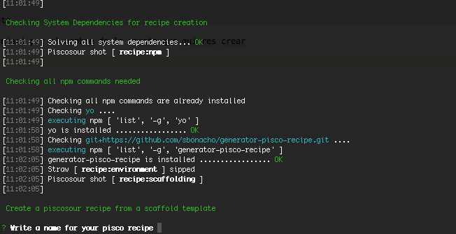
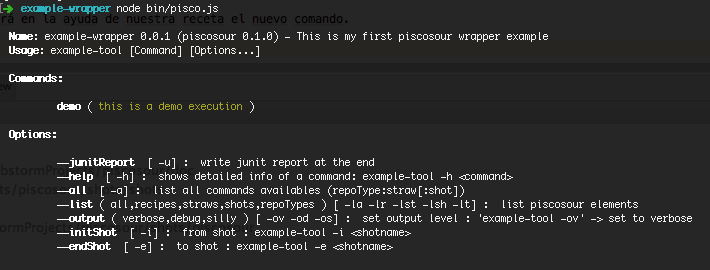

# Instalación de piscosour con npm

La recomendación es instalar pisco de manera global para poder tener acceso al comando pisco desde cualquier lugar. Instalar piscosour como un comando global. (-g) 

    npm install -g piscosour
    
# Crear una receta en 5 minutos
(Receta -> Ejecutable envoltorio)

Una vez instalada la herramienta ejecuta el comando pisco para ver la ayuda general.

    pisco

Sitúate en tu directorio de trabajo y crea tu primera receta. Una receta es un contenedor de shots (pasos) y straws (flujos). 

    mkdir demo
    cd demo
    pisco create

( "pisco create" es un straw de pisco, esto es, un flujo de pasos (shots) que hacen una tarea, verás la salida de la ejecución de cada shot... más tarde te explicaremos que significa cada mensaje, ... es fácil imaginarse que está haciendo leyendo cada uno de los mensajes, pero más adelante verémos más detalle...)  

- Pisco te preguntará por el nombre de la receta que quieres crear. Este será el nombre de tu paquete npm que usarás para compartir la funcionalidad y las herramientas que envuelvas. Introduce el nombre que más te guste.
- Deberás introducir el comando que quieres usar para hacer correr los "straws" (flujos) que vas a introducir en este módulo.
- También deberás introducir una breve descripción para tu módulo.

Mientras pisco genera tu primera receta usando un generator de yeoman. Te explicamos brevemente lo que está pasando ante tus ojos. (no te preocupes, más adelante podrás profundizar más). 

"Pisco create" también es un comando envuelto de pisco que está ejecutando otras herramientas. Cada uno de los mensajes que ves aparecer es la ejecución de un shot (paso). Concretamente este comando conlleva la ejecución de estos pasos.

- system: Comprueba que tu sistema es compatible con la ejecución de piscosour
- npm: Comprueba que tienes instalado todos los módulos npm necesarios (yeoman y el generator-pisco-recipe)
- scaffolding: Hace las preguntas y llama a yeoman para generar el esqueleto del módulo.
 

Listo! ya tienes tu primer ejecutable de pisco creado! pruebalo

    node bin/pisco.js

## Añadir comandos a nuestra receta

Una vez creada nuestra receta nos situamos dentro del directorio que hemos creado.

    cd example-wrapper
    pisco config
    
pisco config nos ayuda a configurar nuestra receta.

1. Nos pregunta si queremos establecer un nuevo tipo de repositorio por defecto. En nuestro ejemplo decimos **"yes"**
2. Nos pregunta el tipo de repositorio. El tipo de repositorio es el lugar donde se va a ejecutar el comando pisco. Normalmente se ejecutará en la raiz de un repositorio git. [Ver que es piscosour para el glosario de términos](what_is_piscosour.md).
Por ejemplo pondremos **"component"**  
3. Pregunta por el nombre del shot que queremos crear. Por ejemplo pondremos: **"show"**
4. El tipo de repositorio sobre el que va a actuar nuestro comando. Por ejemplo pondremos **"component"**
5. Nos pregunta si queremos añadir este shot (paso) a una nueva straw (flujo). **"yes"**
6. Nos pregunta por el comando del straw. Será el comando usado para lanzar nuestra straw. **"demo"**
7. Establecemos el nombre corto del comando será el que aparezca en la ayuda del comando. **"demo execution"**
8. Nos pide una descripción para el comando. **"this is a demo execution"**
9. Seleccionar el tipo de straw que vamos a crear. **"normal"**

Listo! ya tenemos nuestro nuevo comando añadido! Pruebalo.

    node bin/pisco.js

ahora aparecerá en la ayuda de nuestra receta el nuevo comando.

    node bin/pisco.js demo

Ejecutará el nuevo straw que hemos creado con un solo shot

