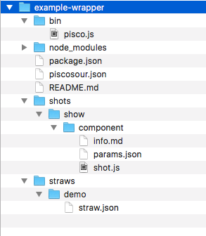

# Trabajar con shots.

Un shot es un paso de ejecución dentro de un flujo de ejecución.

Una vez creada nuestra receta nos situamos dentro del directorio que hemos creado.

    cd example-wrapper
    pisco config

pisco config nos ayuda a configurar nuestra receta.


1. Nos pregunta si queremos establecer un nuevo tipo de repositorio por defecto. En nuestro ejemplo decimos **"yes"**
2. Nos pregunta el tipo de repositorio. El tipo de repositorio es el lugar donde se va a ejecutar el comando pisco. Normalmente se ejecutará en la raiz de un repositorio git. [Ver que es piscosour para el glosario de términos](what_is_piscosour.md).
Por ejemplo pondremos **"component"**
3. Pregunta por el nombre del shot que queremos crear. Por ejemplo pondremos: **"show"**
4. El tipo de repositorio sobre el que va a actuar nuestro comando. Por ejemplo pondremos **"component"**
5. Nos pregunta si queremos añadir este shot (paso) a una nueva straw (flujo). **"yes"**
6. Nos pregunta por el comando del straw. Será el comando usado para lanzar nuestra straw. **"demo"**
7. Establecemos el nombre corto del comando será el que aparezca en la ayuda del comando. **"demo execution"**
8. Nos pide una descripción para el comando. **"this is a demo execution"**
9. Seleccionar el tipo de straw que vamos a crear. **"normal"**

Listo! ya tenemos nuestro nuevo comando añadido! Pruebalo.

    node bin/pisco.js

ahora aparecerá en la ayuda de nuestra receta el nuevo comando.


    node bin/pisco.js demo

Ejecutará el nuevo straw que hemos creado con un solo shot


## Echemos un vistazo a lo que hemos creado.

Se ha generado un módulo node con su package.json y los archivos fundamentales de pisco.

Este es el árbol resultante.



package.json:
```js
{
  "name": "example-wrapper",
  "version": "0.0.1",
  "description": "This is my first piscosour wrapper example",
  "main": "bin/pisco.js",
  "scripts": {
    "deps": "npm install"
  },
  "keywords": [
    "piscosour-recipe"
  ],
  "license": "ISC",
  "preferGlobal": true,
  "bin": {
    "example-tool": "bin/pisco.js"
  },
  "dependencies": {
    "piscosour": "~0.1.0"
  },
  "engines": {
    "node": ">=4.0.0"
  }
}
```

El shot generado tiene esta pinta.

```js
'use strict';

module.exports = {
    description : "Brief description of shot",

    check : function(){
        this.logger.info("#magenta","check","Check all pre-requisites for the execution");
    },

    config : function(){
        this.logger.info("#magenta","config","Preparing params for main execution");
    },

    run : function(){
        this.logger.info("#magenta","run","Run main execution");
    },

    prove : function(){
        this.logger.info("#magenta","prove","Prove that the run execution was ok");
    },

    notify : function(){
        this.logger.info("#magenta","notify","Recollect all execution information and notify");
    }

});


```

puedes ver este ejemplo aquí

[see this example in github](https://github.com/cellsjs/piscosour-examples)

## Procesos asíncronos en shots.

Cada una de las fases de un shot realmente son promesas y reciben dos métodos resolve y reject

```js
  [...]

  run: function(resolve, reject){
     resolve();
  }

  [...]
```

Realmente al final de cada fase se está ejecutando la function resolve de la promesa asociada, pero **se hace de una manera automática**. Si no se hace nada con estas functions el shot se comporta como si todo fuera sincrono.

### ¿Cómo manejar promesas y callbacks en un shot?

Para desactivar la ejecución automática de resolve en un shot es necesario hacer un return de algo distinto de undefined.

```js
  [...]

  run: function(resolve, reject){
     return true;
  }

  [...]
```

**(\*) Importante: (NO RECOMENDABLE, MEJOR USAR UN PLUGIN)** Si queremos que algún shot siga ejecutando algo en background y seguir con la ejecución del resto de shots simplemente no hacer un return de nada. Muy util para que funcionen procesos en background que necesitemas para la ejecución de la straw completa.

Ejemplo de uso de promesas dentro de un shot:

```js
[...]
    run : function(resolve, reject){
    [...]
        return this.execute("yo",this.promptArgs(["pisco-recipe"])).then(resolve,reject);
    }
[...]

```

- this.exexute devuelve una promesa, si hacemos return de esa promesa no estámos devolviendo undefined, por lo tanto el resolve de la promesa no será llamado automáticamente.
- al pasarle los resolve y reject mediante el then a la promesa el shot terminará cuando esta promesa termine.

### Errores en shots

Si se produce un error en un shot y este error no está controlado, **la ejecución de toda la straw parará**. Si queremos registrar un error pero no queremos parar la ejecución de todo el straw deberemos devolver un objeto con la variable keep: true

```js
[...]
    run : function(resolve, reject){

        reject({keep:true, error: txt});
    }
[...]

```

para parar la ejecución dando un error de una menera deliverada:

```js
 [...]
     run : function(resolve, reject){

        if (error)
         reject({error: text});
     }
 [...]

```

Adicionalmente se puede devolver más información sobre el error producido mediante *'data'*. Es especialmente útil en el caso en que se gerere un fichero junit y queremos que aparezcan el detalle del error en el entorno de integración continua (jenkins, bamboo o similar).

```js
 [...]
     run : function(resolve, reject){

        if (error)
         reject({error: text, data: details});
     }
 [...]

```


### Ejecuciones condicionales de shots.

Hace posible en función de unas comprobaciones iniciales, por ejemplo un parámetro de configuración o opción pasada por línea de comando, que la ejecución de un shot se realice o no.

Para ello en la fase **check** del shot deveremos devolver un objeto con el parámetro **skip:true** al ejecutar resolve.

```js
 [...]
     check : function(resolve, reject){

        if (this.params.needThisShot)
         resolve({skip: true});
     }
 [...]

```

El resto de las stages del shot no se ejecutará. por ejemplo si en run limpiamos un directorio mediante este método el limpiado del directorio no se llevará a cabo.


