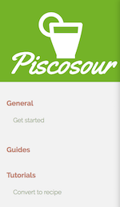

# pisco-documentation-build: Create a documentation webpage.

With this recipe you can create a documentation webpage for your recipe based in your .md files.

This website is intended to show a different documentation for the users of your recipe and for the developers.

For every target (users and developers), the documentation is organized in:

* ```guides``` To explain everything related to your recipe.
* ```tutorials``` Quick and guided examples.
* ```documentation``` for the API documentation.

To install it run:

```shell
npm install -g pisco-documentation-build
```

-----
## How to use it.

### 1. Organize your docs.
In order to create your website correctly, you must organize your docs folder according to this tree:

```
docs
│    index.md
│
└─── users
│    │   get_started.md
|    |   general01.md
|    |   ...
│    └─── guides
│    │    | guide01.md
│    │    | ...
│    │    
│    └─── tutorials
│         | tutorial01.md
│         | ...
│       
└─── developers
│    │   get_started.md
|    |   general02.md
|    |   ...
│    └─── guides
│    │    | guide02.md
│    │    | ...
│    │    
│    └─── tutorials
│         | tutorial02.md
│         | ...
│
└─── images
│    │   image01.jpg
│    │   ...
│
```

**Required files and folders:**

* It's required to have an ```index.md``` in the root of your documentation folder. (See the next step to see how to create one).
* It's required to have the folders ```users``` and ```developers```.
* It's required to have a ```get_started.md``` file at ```users``` and ```developers``` folders.
* It's required to have a ```logo.svg``` file in your ```images``` folder.

**Other considerations:**

* It's not mandatory but recommended to have ```guides``` and ```tutorials```. Even if you don't have any the submenu will appear.



* If you use images in your md files, you should place them in a ```images``` folder at the ```docs``` folder root.

### 2. Create an index.md
It's necessary to create an ```index.md``` in the root of your documentation folder in order to have an entry point of your website.
The content of this file should be only this metadata.

```
---
toolName: [Your tool name]
claim: [A short and fresh sentence]
npmName: [Tool name in npm]
layout: index.html
---
```

* ```layout``` will be always ```index.html``` for the index.md file.

### 3. Add metadata to all your md files.
It's necessary to provide a little bit of information about your documentation files to create the webpage correctly, so all your md files shoud have this metadata at the top.

```
---
title: [Page title]
layout: doc_page.html
---
```

* ```title``` will be always the name of the link in the main menu.
* ```layout``` will be always ```doc_page.html``` for your documentation files.

### 4. Set a template to create the site.
In order to generate the site, you can use the default pisco template for sites ([pisco-site-template-basic](https://globaldevtools.bbva.com/bitbucket/projects/CTOOL/repos/pisco-site-template-basic/browse)) or create your own template.

To set the template you should add it as dependency **in your project**.
For example, if you use the default pisco template, just add in your project's ```package.json```:

```json
{
"pisco-site-template-basic": "*"
}
```

### 5. Add a logo.
It's mandatory to have a ```logo.svg``` file in your ```docs/image``` folder. This is the file used to print the logo at your index page an in the menu.

### 6. Add guides and tutorials.
Now you can add as much guides and tutorials as you want to your documentation.
Add a md file for each guide or tutorial trying to use the best practices that you can find at the end of this doc.

### 7. Generate auto-documentation pages.
As we commented in the first lines we will have **guides**, **tutorials**, and ```documentation``` for every target.
This documentation is automatically filled when you run ```recipe:docs``` flow.
This flow will automatically create:
* A ```documentation``` folder at ```users``` with one md file for each command available at your recipe.
* A ```documentation``` folder at ```developers``` with the documentation of each plugin of your recipe.

So, in order to have this

### 8. Create your site!
Ok, now everything is ready to create your site *automagically*!. Just run:

```bash
pisco documentation:build
```

Or if your documentation folder is not ```docs```

```bash
pisco documentation:build --docsSource [folder-name]
```

This will create your site files in a folder named ```dist```. If you want to use a different name, just run:

```bash
pisco documentation:build --destination [destination-folder]
```

* If your repo is a github repo, you will be asked to upload the website as Github Pages. This, internally, will create/update a branch named ```gh-pages``` with the content of the dist folder.

## Best practices writing your md files.

### Use only one h1.
Your md documents should have one and only one h1 (# whatever) which is the title of your document.

### Code blocks
The markdown parser will guess which language are you using in your code blocks, but to ensure a good highlight just add to your code block what language are you adding the language name to it as follows:

* bash:

~~~
```bash
[your code]
```
~~~

* javascript:

~~~
```javascript
[your code]
```
~~~

* json

~~~
```json
[your code]
```
~~~

* You will find a complete list at this link: [Highlight supported languages](https://highlightjs.org/static/demo/)